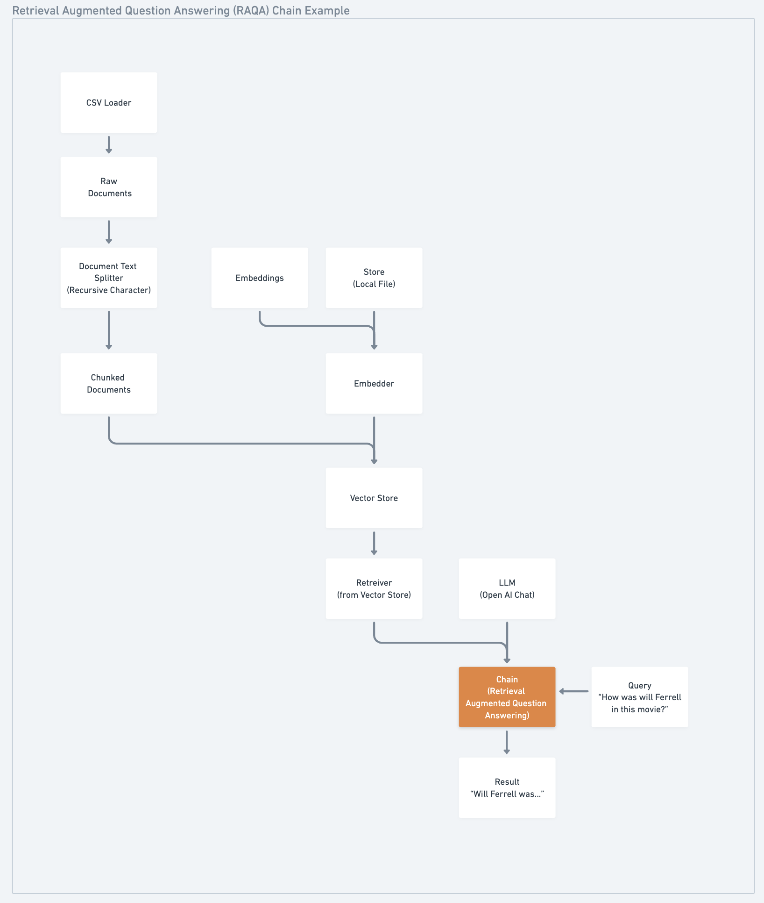

# Week 1: Tuesday Session

In today's assignment, we'll be creating a simplified RAQA system using OpenAI, LangChain, FAISS, and Chainlit.

There are 3 main sections to this assignment:

## Build 🏗️

Following the provided notebook - you'll build a simplified RAQA system to ask questions over some reviews of the movie Barbie.

This will take you through three major steps: 

1. Collecting and parsing data
2. Building an Index (VectorStore)
3. Chaining your Index together with an OpenAI LLM model.

### Deliverables

- Completed Notebook
- System Diagram of the RAQA Application

## Ship 🚢

Duplicate the provided [Hugging Face Space](https://huggingface.co/spaces/ai-maker-space/Barbie-RAQA-Application-Chainlit-Demo)

### Deliverables

- A short Loom of the space, and a 1min. walkthrough of the application in full

## Share 🚀

Make a social media post about your final application!

### Deliverables

- Make a post on any social media platform about what you built!

What we're building:

